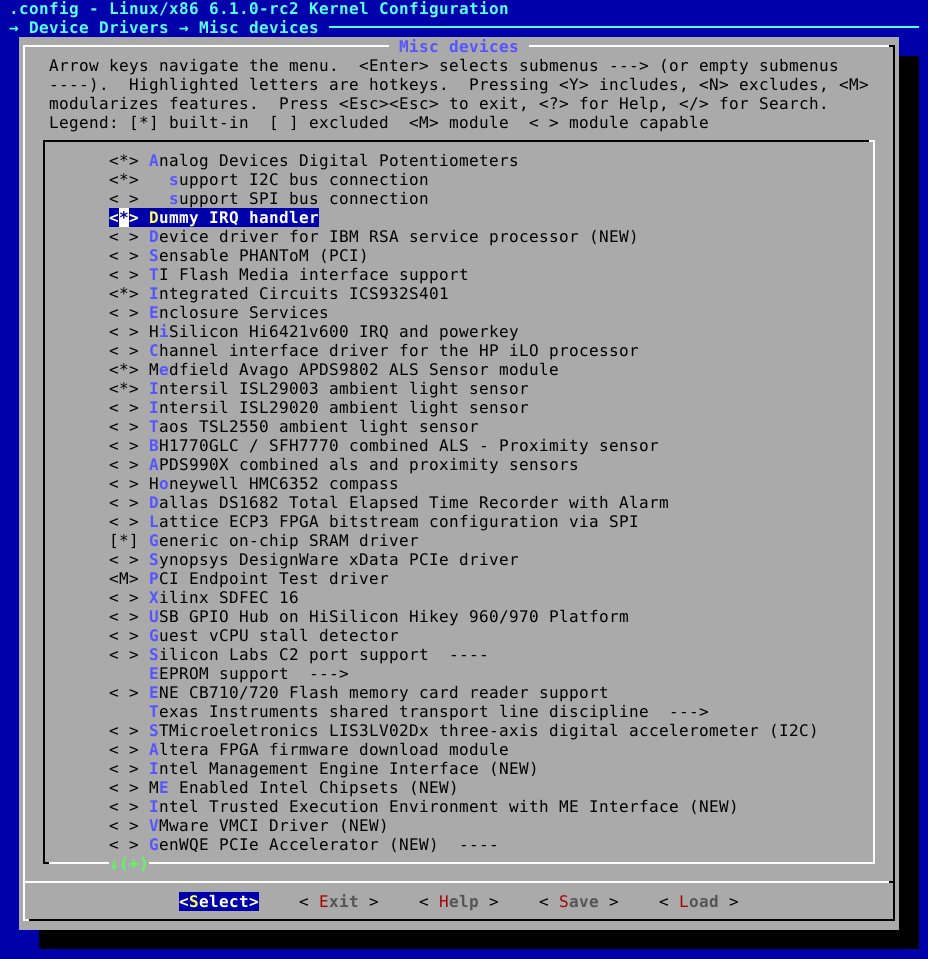
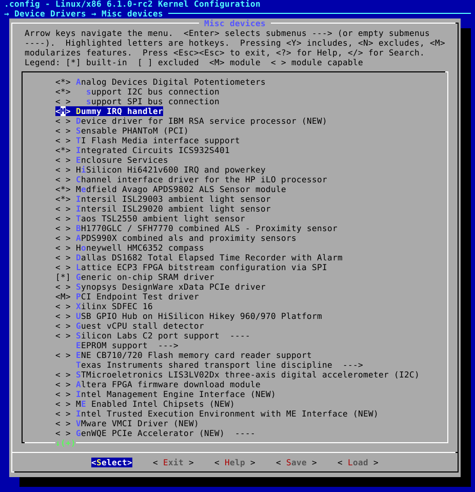

# Lab 2 - Linux kernel
The purpose of the lab is to learn about the Linux kernel and its features.

By doing the lab, the user will learn to:
 - Build the Linux kernel.
 - Configure the Linux kernel.
 - Run the Linux kernel in various ways on an embedded system.

Tasks:
 - Add any driver built into the kernel.
 - Add any driver compiled as a kernel module.
 - Compile the kernel and run it using TFTP in u-boot. (Hint: The address at which the kernel should be loaded is `0x61000000`, the DTB loading address is `0x63000000`. Bootargs should be set to `console=ttyAMA0`)

Platform: `vexpress_ca9x4`

## Solution

1. Download u-boot:

    ```bash
    git clone git://git.denx.de/u-boot.git
    cd u-boot
    git checkout v2019.04
    ```

2. Apply solution of tasks:

    ```bash
    git apply ../labs/lab2/lab2-ans.patch
    ```

3. Configure and build u-boot:

    ```bash
    make vexpress_ca9x4_defconfig ARCH=arm CROSS_COMPILE=arm-linux-gnueabihf-
    make -j4 ARCH=arm CROSS_COMPILE=arm-linux-gnueabihf-
    ```

4. Download Linux kernel:
    ```bash
    cd ..
    git clone git://git.kernel.org/pub/scm/linux/kernel/git/stable/linux-stable.git linux
    cd linux
    ```

5. Configure Linux kernel:
    ```bash
    make ARCH=arm CROSS_COMPILE=arm-linux-gnueabihf- multi_v7_defconfig
    ```

6. Compile the kernel and the dtb:
    ```bash
    make -j4 ARCH=arm CROSS_COMPILE=arm-linux-gnueabihf- zImage
    make CROSS_COMPILE=arm-linux-gnueabihf- ARCH=arm dtbs
    ```

7. Compile the modules:

    ```bash
    make -j4 ARCH=arm CROSS_COMPILE=arm-linux-gnueabihf- modules
    make -j4 ARCH=arm CROSS_COMPILE=arm-linux-gnueabihf- INSTALL_MOD_PATH=$HOME/rootfs modules_install
    ```

8. Create /home/student/tftp directory:

    ```bash
    mkdir -p /home/student/tftp
    ```

9.  Copy `zImage` and `vexpress-v2p-ca9.dtb` to tftp folder:
    ```bash
    cp arch/arm/boot/zImage /home/student/tftp
    cp arch/arm/boot/dts/vexpress-v2p-ca9.dtb /home/student/tftp
    ```

11. Run qemu:

    ```bash
    cd ../u-boot
    QEMU_AUDIO_DRV=none qemu-system-arm -M vexpress-a9 -m 256M -serial stdio -monitor none -nographic -kernel u-boot -net nic -net user,tftp=/home/student/tftp
    ```

## Output
After boot sequence you should see:
```bash
...
[    2.393397] Kernel panic - not syncing: VFS: Unable to mount root fs on unknown-block(0,0)
[    2.393714] CPU: 0 PID: 1 Comm: swapper/0 Not tainted 6.1.0-rc2-00338-g576e61cea1e4 #1
[    2.393940] Hardware name: ARM-Versatile Express
[    2.394664]  unwind_backtrace from show_stack+0x10/0x14
[    2.395180]  show_stack from dump_stack_lvl+0x40/0x4c
[    2.395288]  dump_stack_lvl from panic+0x108/0x33c
[    2.395439]  panic from mount_block_root+0x168/0x208
[    2.395596]  mount_block_root from prepare_namespace+0x150/0x18c
[    2.395724]  prepare_namespace from kernel_init+0x18/0x12c
[    2.395852]  kernel_init from ret_from_fork+0x14/0x2c
[    2.396023] Exception stack(0xd0825fb0 to 0xd0825ff8)
[    2.396250] 5fa0:                                     00000000 00000000 00000000 00000000
[    2.396609] 5fc0: 00000000 00000000 00000000 00000000 00000000 00000000 00000000 00000000
[    2.396788] 5fe0: 00000000 00000000 00000000 00000000 00000013 00000000
[    2.397297] ---[ end Kernel panic - not syncing: VFS: Unable to mount root fs on unknown-block(0,0) ]---
```

This is due to the lack of rootfs. This is a planned "kernel panic".

## Adding drivers

1. Add driver built into the kernel.
    

2. Add any driver compiled as a kernel module.
    