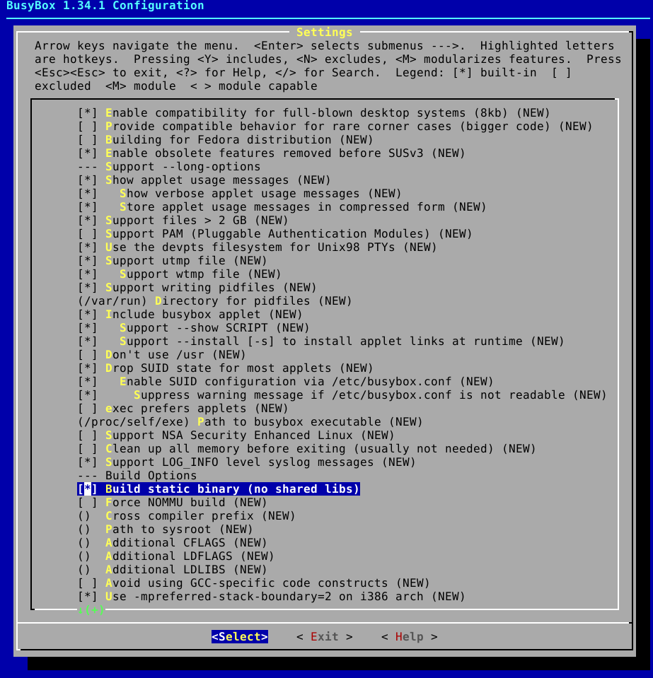

# Lab 3 - BusyBox
The purpose of the lab is to learn about the BusyBox file system and its features.

By doing the lab, the user will learn to:
 - Build a file system dedicated to Linux.
 - Configure the file system to customize it.
 - Add custom applications to the file system.
 - Load the file system into the system in various ways.

Tasks:
 - Load the kernel, uRamdisk and DTB file using TFTP in u-boot and boot Linux. (Hint: load uRamdisk at address `0x62000000`).
 - Add your own program to the package without recompiling BusyBox.
 - Boot the system using u-boot in such a way that BusyBox files are loaded using NFS.

Platform: `vexpress_ca9x4`

## Solution (without nfs)

1. Download u-boot:

    ```bash
    git clone git://git.denx.de/u-boot.git
    cd u-boot
    git checkout v2019.04
    ```

2. Apply solution of tasks:

    ```bash
    git apply ../labs/lab2/lab2-ans1.patch
    ```

3. Configure and build u-boot:

    ```bash
    make vexpress_ca9x4_defconfig ARCH=arm CROSS_COMPILE=arm-linux-gnueabihf-
    make -j4 ARCH=arm CROSS_COMPILE=arm-linux-gnueabihf-
    ```

4. Download Linux kernel:

    ```bash
    cd ..
    git clone git://git.kernel.org/pub/scm/linux/kernel/git/stable/linux-stable.git linux
    cd linux
    ```

5. Configure Linux kernel:

    ```bash
    make ARCH=arm CROSS_COMPILE=arm-linux-gnueabihf- multi_v7_defconfig
    ```

6. Compile the kernel and the dtb:

    ```bash
    make -j4 ARCH=arm CROSS_COMPILE=arm-linux-gnueabihf- zImage
    make CROSS_COMPILE=arm-linux-gnueabihf- ARCH=arm dtbs
    ```

7. Compile the modules:

    ```bash
    make -j4 ARCH=arm CROSS_COMPILE=arm-linux-gnueabihf- modules
    make -j4 ARCH=arm CROSS_COMPILE=arm-linux-gnueabihf- INSTALL_MOD_PATH=$HOME/rootfs modules_install
    ```

8. Create /home/student/tftp directory:

    ```bash
    mkdir -p /home/student/tftp
    ```

9. Copy `zImage` and `vexpress-v2p-ca9.dtb` to tftp folder:

    ```bash
    cp arch/arm/boot/zImage /home/student/tftp
    cp arch/arm/boot/dts/vexpress-v2p-ca9.dtb /home/student/tftp
    ```

10. Download and unpack BusyBox:

    ```bash
    wget https://busybox.net/downloads/busybox-1.34.1.tar.bz2
    tar xjvf busybox-1.34.1.tar.bz2
    cd busybox-1.34.1
    ```

11. Configure BusyBox:

    ```bash
    make ARCH=arm menuconfig
    ```
    You need to set option **Settings->Build Options->Build BusyBox as a static binary (no shared libs)**

    

12. Compile BusyBox:

    ```bash
    make -j4 CROSS_COMPILE=arm-linux-gnueabihf-
    ```

13. Create system directories:

    ```bash
    cd ..
    mkdir rootfs
    cd rootfs/
    mkdir bin dev etc home lib proc sbin sys tmp usr var
    mkdir usr/bin usr/lib usr/sbin
    mkdir var/log
    ```

14. Install BusyBox:

    ```bash
    cd ../busybox-1.34.1
    make CROSS_COMPILE=arm-linux-gnueabihf- install CONFIG_PREFIX=../rootfs/
    cd ../rootfs
    sudo mknod -m 666 dev/null c 1 3
    sudo mknod -m 600 dev/console c 5 1
    ```

17. Compile sample application:

    ```bash
    cd ..
    arm-linux-gnueabihf-gcc --static -o labs/lab3/hello_world labs/lab3/hello_world.c
    ```
18. Copy application to rootfs `/home` directory:

    ```bash
    cp labs/lab3/hello_world rootfs/home/
    ```

19. Build filesystem image:

    ```bash
    cd rootfs
    find . | cpio -H newc -ov --owner root:root > ../initramfs.cpio
    cd ..
    gzip initramfs.cpio
    mkimage -A arm -O linux -T ramdisk -d initramfs.cpio.gz uRamdisk
    ```

20. Copy `uRamdisk` to tftp directory:

    ```bash
    cp uRamdisk /home/student/tftp/
    ```

19. Run qemu:

    ```bash
    cd ../u-boot
    QEMU_AUDIO_DRV=none qemu-system-arm -M vexpress-a9 -m 256M -serial stdio -monitor none -nographic -kernel u-boot -net nic -net user,tftp=/home/student/tftp
    ```

## Solution (with nfs)

Follow steps `1-19` from the instructions above.

Next:

1. Install NFS server:

    ```bash
    sudo apt-get install nfs-kernel-server
    ```

2. Apply patch and rebuild u-boot:

    ```bash
    cd u-boot
    git apply ../labs/lab3/lab3-ans2.patch
    make vexpress_ca9x4_defconfig ARCH=arm CROSS_COMPILE=arm-linux-gnueabihf-
    make -j4 ARCH=arm CROSS_COMPILE=arm-linux-gnueabihf-
    cd ..
    ```

3. Copy filesystem to NFS directory:

    ```bash
    mkdir /srv/nfs
    cp -r rootfs /srv/nfs/
    ```

4. Configure NFS server's shares:

    ```bash
    chown 1000:1000 /srv/nfs
    echo "/srv/nfs *(ro,sync,no_subtree_check,all_squash,insecure,anonuid=1000,anongid=1000)" | tee -a /etc/exports
    ```

## Output
After boot sequence you should see prompt:

```bash
/ #
```

You can now execute `hello_world`:

```bash
/ # ./home/hello_world
Hello world!
/ #
```
