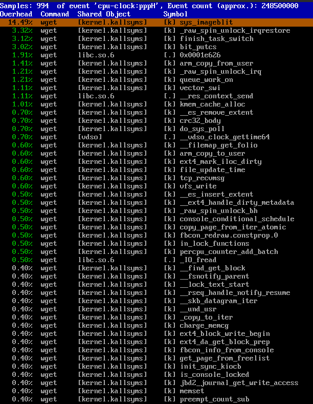

# Lab 5 - YoctoProject
The purpose of the lab is to learn about YoctoProject.

Prepare screenshots for the following tasks:
 - Install the perf program to the created Yocto system.
 - Using perf, measure the data for the "wget http://www.cs.put.poznan.pl/mnaumowicz/html/SOiASW/OSAES_lec1.pdf" command.
 - Visualize the data collected by perf.
 - View information about the perf program license.

Platform: `vexpress_ca9x4`

## Solution

1. Download and build Buildroot:

    ```bash
    sudo apt install git texinfo diffstat chrpath gawk zstd lz4 wget git-core diffstat unzip texinfo gcc-multilib \
        build-essential chrpath socat cpio python python3 python3-pip python3-pexpect \
        xz-utils debianutils iputils-ping libsdl1.2-dev xterm -y
    git clone git://git.yoctoproject.org/poky.git
    cd poky
    source oe-init-build-env build-qemuarm
    ```

3. Configure `poky`:

    ```bash
    txt='MACHINE ?= "qemuarm"'; sed -i "/^#$txt/ c$txt" conf/local.conf
    ```

4. Add `perf`:

    ```bash
    echo 'IMAGE_INSTALL:append = " perf"' >> conf/local.conf
    ```

5. Build minimal core:

    ```bash
    bitbake core-image-minimal
    ```

6. Run qemu:

    ```bash
    runqemu qemuarm
    ```

## Answers and screenshots

1. Run in qemu
   1. Add dns server to `/etc/resolv.conf`:

       ```bash
       echo 'nameserver 8.8.8.8' >> /etc/resolv.conf
       ```

   2. Using perf, measure the data for the `wget`:

       ```bash
       perf record wget http://www.cs.put.poznan.pl/mnaumowicz/html/SOiASW/OSAES_lec1.pdf
       ```

   3. Visualize the data collected by perf:

       ```bash
       perf report
       ```

   


2. View information about the perf program license

    ```bash
        cd poky
        cat build-qemuarm/tmp/deploy/licenses/perf generic_GPL-2.0-only
    ```
